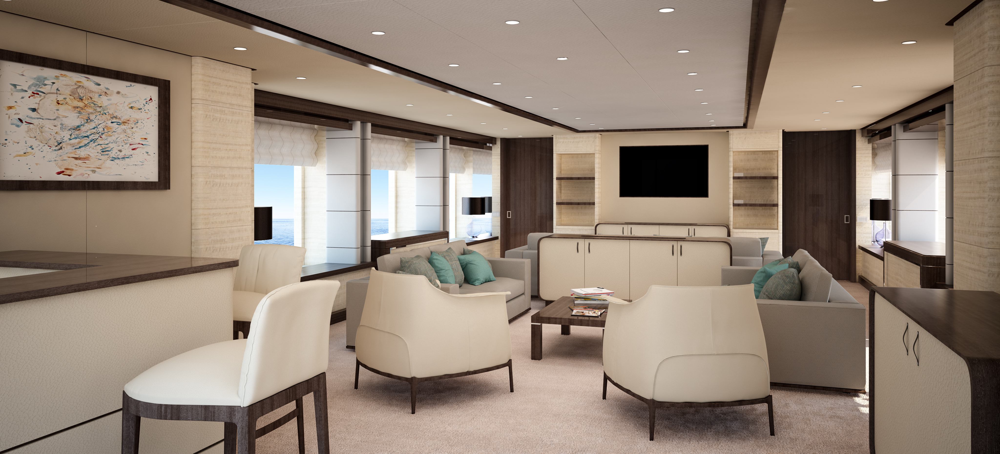
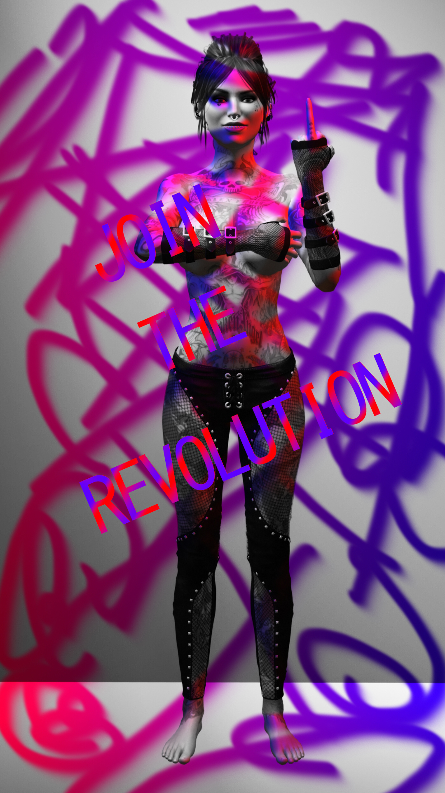
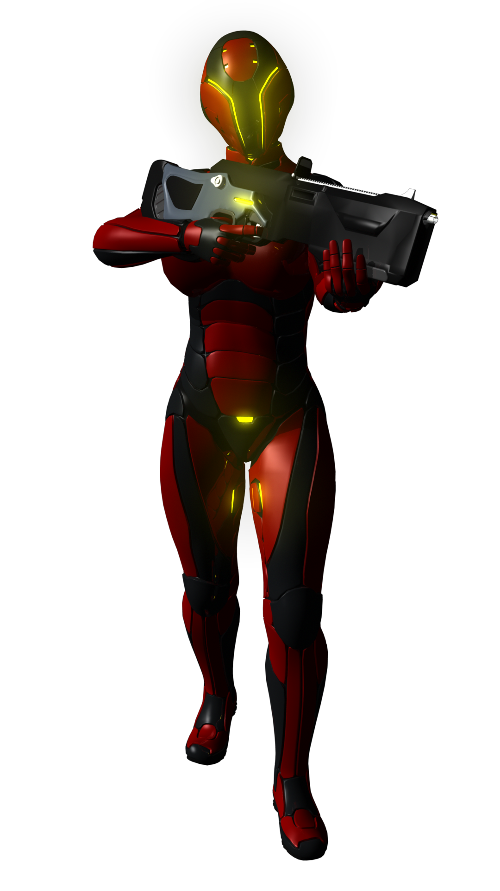
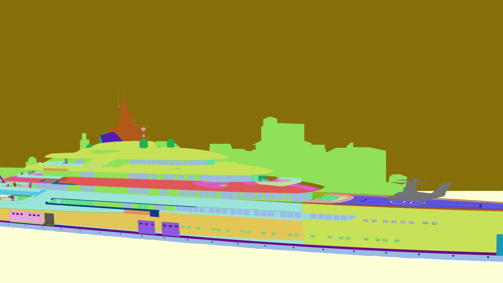

# Matteo Cosimi
> Questo è il mio sito di presentazione su GitHub

**Chi sono?**

*3D Generalist con capacità nell'uso di programmi di modellazione e rappresentazione 3D e di programmi di fotoritocco*

*Studio Game Design presso [TheSign - Comics & Arts Academy Firenze](https://thesign.academy/)*

**Programmi Usati**:
- [Autodesk Maya](https://www.autodesk.it/products/maya/overview)
- [Autodesk 3DSMax](https://www.autodesk.it/products/3ds-max/overview)
- [Autodesk VRED](https://www.autodesk.com/products/vred/overview)
- [Pixologic ZBrush](https://pixologic.com/)
- [Blender](https://www.blender.org/)
- [TopoGun](http://www.topogun.com/)
- [Allegorithmic Substance Painter](https://www.allegorithmic.com/products/substance-painter)
- [Adobe Photoshop CC](https://www.adobe.com/it/products/photoshop.html)

# Portfolio (Aggiornato al 06/2018)
- [Portfolio](https://docs.google.com/presentation/d/1MrGrAmtoWK9QWI4bqQi0HQVQjVcMwtn43kz0w0t0_14/edit?usp=sharing) 

# Lavori Svolti Giocabili
- [Fictitiousgram](https://dedsec94.github.io/Fictitiousgram/)

**Immagini di Lavori Svolti**

# Contatti
- [Instagram: @meaningfuldesigner](https://www.instagram.com/meaningfuldesigner/?hl=it)
- [Gmail: matteocosimi94@gmail.com]()
- [Outlook: matteocosimi@hotmail.com]()
